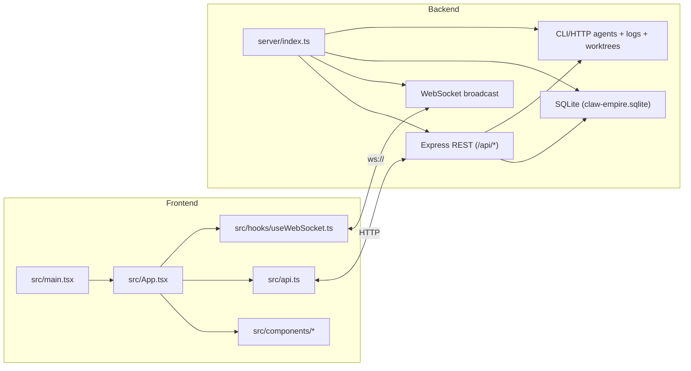
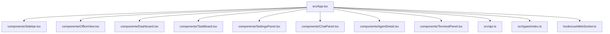
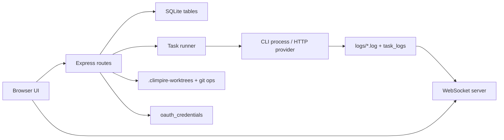
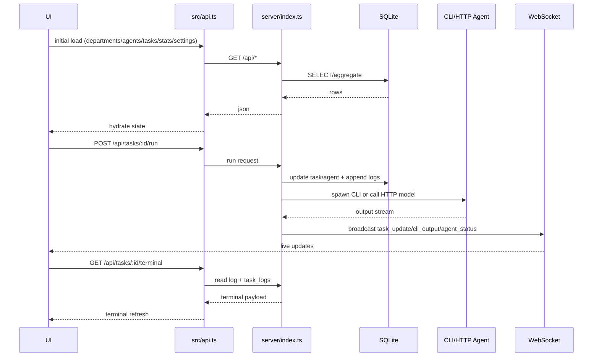

# CEO Structure Map

Generated from parallel architecture analysis lanes:
1. Frontend module map (`src/`)
2. Backend module map (`server/`)
3. Tooling/docs map (`scripts/`, `docs/`)
4. Build/config map (`package.json`, `tsconfig*`, `vite.config.ts`, `.env*`)
5. End-to-end runtime sequence (UI -> API -> DB/CLI -> WS -> UI)
6. Repository inventory (tree and key files)

## High-Level System Map



## Frontend Composition



## Backend Runtime Surface



## Core Runtime Sequence



## Key Files

- Runtime entry: `server/index.ts`, `src/main.tsx`, `src/App.tsx`
- API contract layer: `src/api.ts`
- Shared model types: `src/types/index.ts`
- Visualization generator: `scripts/generate-architecture-report.mjs`
- Generated artifacts: `docs/architecture/README.md`, `docs/architecture/*.mmd`, `docs/architecture/architecture.json`

## Refresh Commands

```bash
npm run arch:map
```
